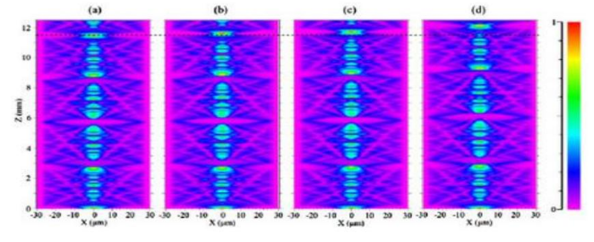

```{r setup, include=FALSE}
library(flexdashboard)
library(tidyverse)
library(stringr)
library(plotly)
library(echarts4r)
library(vroom)
library(here)

# here::i_am('BEng Thesis')

readOneFile <- function(fileName) {
  x <- file(fileName, "r") 
  toSkip <- (readLines(fileName, 300) == "\"[TRACE DATA]\"") %>% 
    which() %>% 
    .[1]
  
  df <- read_csv(fileName, skip = toSkip)
  colnames(df) <- colnames(df) %>% 
    gsub('Tr.', '', .) %>% 
    gsub('WL.', 'WL', .) %>% 
    gsub('..LOG.', '', .) %>% 
    gsub('\\(', '.', .)
  
  # Too lazy to figure out one line
  imap_dfr(((1:(ncol(df) / 2) - 1) * 2 + 1), function(x, y) {
    
    df[,x:(x+1)] %>% 
      mutate(i = y) %>% 
      setNames(c('wl', 'level', 'var'))
  })
  # 
  # df <- reshape(data = df, 
  #               varying = colnames(df), 
  #               timevar = 'var',
  #               times=c('A','B','C','D','E','F','G'),
  #               v.names = c('WL', 'LEVEL'),
  #               direction = 'long') 
  # df$var <- sapply(df$var, utf8ToInt) %>% unlist() - 64
  # print(colnames(df)) 
  # dd
}

joinData <- function(tibbles) {
  # x = 0
  tibbles %>% 
    imap_dfr(function(tibb, i) {
      tibb %>% mutate(var = var + ((i - 1 )* 7))
    }) 
    
    
  # for (i in 1:length(tibbles)) {
  #   crntMax<- tibbles[[i]] %>% count(var) %>% .$var %>% max
  #   tibbles[[i]]$var <- tibbles[[i]]$var + x
  #   x <- x + crntMax
  # }
  # returned <- bind_rows(tibbles) %>% select(var, WL, LEVEL) %>% mutate(name = plot.name)
  # colnames(returned) <- c('var', 'level', 'wl', 'Series')
  # returned
}

cal <- function(x) {
  a = 0.19
  b = -183
  c = 0.062
  d = 0.29
  (a - (b / ((c * x/2 + 1)^(1/d))))*3.454897
  }

# First page:
finals1 <- readRDS(here('BEng Thesis/OSA/A3x_Kapilara 3um 35mm zmoczona APG E26/peaks_data.rds'))
finals1$mag <- cal(finals1$caps)
finals1 <- finals1 %>% mutate(delta = wl - min(wl))
finals1.lm <- finals1 %>% filter(mag < 260) 


# setwd("/home/dominik/Programowanie/R/Dashboards/BEng Thesis/OSA/A3x_Kapilara 3um 35mm zmoczona APG E26/")
# '3um 35mm, ferrofluid outside'
first.df <- here('BEng Thesis', 'OSA', 'A3x_Kapilara 3um 35mm zmoczona APG E26') %>% 
  list.files(full.names = TRUE, pattern = ".*.CSV") %>%
  # str_subset(".*.CSV") %>% 
  map(readOneFile) %>% 
  joinData()
first.df$var = factor(first.df$var)

#
## 'EHF-1 1µm 72mm'
d1 <- here("BEng Thesis/OSA/1um/A000-2_EHF-1 1µm 72mm") %>% 
  list.files(full.names = TRUE, pattern = ".*.CSV") %>% 
  map(readOneFile) %>% 
  joinData() %>% 
  filter(level > -88) %>% 
  mutate(Series = 'EHF-1 1µm 72mm')

## 'EHF-1 1µm 57mm'
d2 <- 
  here("BEng Thesis/OSA/1um/A005-7_EHF-1 1µm 57mm/") %>% 
  list.files(full.names = TRUE, pattern = ".*.CSV") %>% 
  map(readOneFile) %>% 
  joinData() %>% 
  filter(level > -70) %>% 
  mutate(Series = 'EHF-1 1µm 57mm')

## 'APG E26 6um 95mm'
d3 <- 
  here("BEng Thesis/OSA/6um/D5x_APG E26 6um 95mm/") %>% 
  list.files(full.names = TRUE, pattern = ".*.CSV") %>% 
  map(readOneFile) %>% 
  joinData() %>%
  filter(level > -105) %>% 
  mutate(Series = 'E26 6um 95mm')

d4 <- 
  here("BEng Thesis/OSA/6um/D6x_APG E26 6um 77mm/") %>% 
  list.files(full.names = TRUE, pattern = ".*.CSV") %>% 
  map(readOneFile) %>% 
  joinData() %>% 
  filter(level > -70) %>% 
  mutate(Series = 'E26 6um 77mm')

d5 <- 
  here("BEng Thesis/OSA/3um/D10x_APG E26 3um 33mm/") %>% 
  list.files(full.names = TRUE, pattern = ".*.CSV") %>% 
  map(readOneFile) %>% 
  joinData() %>%
  filter(level > -82) %>% 
  mutate(Series = 'E26 3um 33mm')

d6 <- 
  here("BEng Thesis/OSA/3um/D20x_APG E26 3um 29mm/") %>% 
  list.files(full.names = TRUE, pattern = ".*.CSV") %>% 
  map(readOneFile) %>% 
  joinData() %>% 
  mutate(Series = 'E26 3um 29mm')

many.data <- bind_rows(d1, d2, d3, d4, d5, d6)
many.data$var = factor(many.data$var)
# 
# 
# setwd('./../BEng Thesis/')
```

Overall Description
===================================== 

Column {data-width=500}
-----------------------------------------------------------------------

### **This webpage is a summary of my Bachelor of Engineering Thesis.**

**If you would like to see plots, just go to the next page. Otherwise, this is a short introduction so this can be understood in a glimpse.**

The point of my thesis was to build a magnetic field sensors that uses an optical fibre. This was accomplished by building different types of interferometers, with ferrofluid reacting with magnetic field. 

The sensor with a ferrofluid-filled capillary described in this paper has not been previously described in literature, or I couldn't find any.

### Interference:

  When two waves of light meet each other, and their lengths match, they can add or subtract from each other. This is called interference. This act will be used to detect changes in optical properties of a fluid - which is dependent on the magnetic field. The interference can also happen for a whole range of wavelengths a the same time. In our case, the light can interfere when it is inside of a *capillary*.

### Used items:

  A *cappilary*, or "no core fibre" is just a tiny and very thin glass tube. It has a small hole inside, and we can put a liquid inside of it.

  A *ferrofluid* is a fluid, filled with tiny particles that react with magnetic field. That way, we can change the most important property - the angle by which light gets reflected - using magnetic field. In my study, I tested two ferrofluids made by Ferrotec company.
  
  Unfortunately the lasers that I have used are not to be seen by human eye. Fortunately, I can still shine red light through elements that I've build.


Column {data-width=500}
-----------------------------------------------------------------------

### The princible - summing up:

By placing a cappilary in a ferrofluid, we can alter its optical property using magnetic field. That way, and adding that each wavelength refracts at a slightly different angle, we can measure changes of the amount of  light that gets through our measuring element.  


Type I
===================================== 

Column {data-width=700}
-----------------------------------------------------------------------

### Whole range of wavelengths, each next series have greater magnetic induction:

```{r}
whole1 <- first.df %>%
  ggplot(aes(x = wl, y = level, color = var)) + 
  geom_line(size = .2) + 
  theme_classic() +
  labs(x = "wavelength[nm]", 
       y = "transmitted power[dBm]", 
       colour = "Series")
ggplotly(whole1) %>% config(displayModeBar = F) 

# first.df %>% 
#   hchart('spline', hcaes(x = wl, y = level, group = var))
```

### Above plot, zoomed at the area of interest:

```{r}
whole2 <- first.df %>% 
  filter(wl > 1330, wl < 1360) %>%
  ggplot(aes(x = wl, y = level, color = var)) + 
  geom_line(size = .2) + 
  theme_classic() + 
  theme(plot.subtitle = element_text(vjust = 1),
        plot.caption = element_text(vjust = 1)) +
  labs(x = "wavelength[nm]", 
       y = "transmitted power[dBm]", 
       colour = "Series")
ggplotly(whole2) %>% config(displayModeBar = F) 
```

Column {data-width=300}
-----------------------------------------------------------------------

### Basic schema for how the sensor works:


### Linear relation of transmission peak's power as a function of magnetic indunction:

```{r}
side1 <- ggplot(data = finals1) + 
  geom_point(aes(x = mag, y = pow)) + 
  geom_smooth(data = finals1.lm, aes(x = mag, y = pow), method = 'lm') +
  theme_classic() + 
  labs(title="Change of transmission peak's power",
       x='magnetic induction[mT]',
       y='transmitted power[dBm]')  + 
  scale_color_manual(name = "e")
ggplotly(side1) %>% config(displayModeBar = F) 
```

### Quadratic relation of transmission peak's wavelength shift as a function of magnetic indunction:

```{r}
side2 <- ggplot(data = finals1) + 
  geom_point(aes(x = mag, y = delta)) + 
  geom_smooth(aes(x = mag, y = delta), method = 'lm', formula = y ~ x + I(x^2)) +
  theme_classic() + 
  labs(title="Change of transmission peak's wavelength",
       x='magnetic induction[mT]',
       y='wavelength shift[nm]')  + 
  scale_color_manual(name = "e")
ggplotly(side2) %>% config(displayModeBar = F) 
```

Type II
===================================== 

<!-- Column {data-width=600} -->
<!-- ----------------------------------------------------------------------- -->


```{r}
many.plots <- many.data %>%
  ggplot(aes(x = wl, y = level, color = var)) + 
  geom_line(size = .2) + 
  facet_wrap(Series ~., scales = 'free') +
  theme_classic() +
  labs(x = "wavelength[nm]", 
       y = "transmitted power[dBm]", 
       colour = "Series") + theme(strip.background = element_blank())
ggplotly(many.plots) %>% config(displayModeBar = F)

```

<!-- Column {data-width=400} -->
<!-- ----------------------------------------------------------------------- -->
